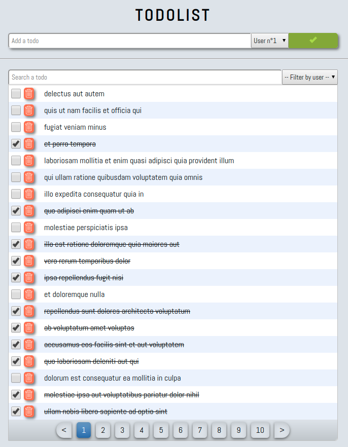

# Single Page Todolist Application without JS frameworks or libraries

<p align="center">
    
    <p align="center"> Preview of the todolist application </p>
</p>

## Run the application

```
git clone https://github.com/PAJEAN/spa_without_framework
cd spa_without_framework
node server.js
```

And go to http://localhost:8000/.

The application makes a ajax call to get fake todos on <a href="https://jsonplaceholder.typicode.com/guide.html">jsonplaceholder</a>.

## Some context

<p align="justify">
This project aims to build a full <i>single page application</i> in vanilla Javascript without any frameworks or libraries with : i) a component-based approach (using <i>customElements</i> objects, templates and shadow root), ii) a central state manager (derived from the Vuex logic) and iii) a router to navigate between pages.
It allowed me to demystify some aspects of modern frameworks and at the same time to program my own adjustable JS architecture to develop future (little and modest) projects.
One of my initial motivations was to see if is it possible to not depend of modern frameworks, with a component-based approach and a scalable architecture. This desire comes from with the multiplication of JS developement Frameworks (Angular, React, Vue, Ember, Svelte, etc. - who is next ?) and their fast updates where some of them ask to developers to refactoring pieces of codes. I'm not here to demonize them, it offers different ways to neatly think and build a project and it facilitates some aspects of the developement. However, we can easily be lost in the choise of the needed technology (and some subjective benchmarks don't help us) and developers can be quickly sumitted by clients/companies to learn (again and again) a new technology (to do a thing that it can develop otherwise) or by the technology itself (with it's fast obsolescence).
I will not lie, I only used Vuejs and a little bit of ReactJs, so I'm not here to share religious words. I'm just a curious programer with the will to discover more about what's under the hood.
</p>

<p align="justify">
My initial researches about this project led me to the interesting Nicholas C. Zakas's talk (<a href="https://fr.slideshare.net/nzakas/scalable-javascript-application-architecture">ref</a>) about scalable JS applications. This talk dates from 2009 so, long before ES6 and modern frameworks, but it's a really good reading on how to modularize and extend a Javascript project (if you are interesting by some implementations: <a href="https://code.tutsplus.com/tutorials/writing-modular-javascript--net-14746">Andrew Burgess</a>, <a href="http://scaleapp.org/">scaleapp</a> by Markus Kohlhase, <a href="https://github.com/valentin-lozev/justcore">justcore</a> by Valentin Lozev or <a href="https://github.com/aurajs/aura">aura</a> by Addy Osmani - at the same time I recommand you <a href="https://addyosmani.com/resources/essentialjsdesignpatterns/book/">Learning JavaScript Design Patterns</a> by Addy Osmani).
Then, I started to deepen specifications that I fixed for this project and I begun by the component-based constraint.
</p>

### *customElements* as reusable web components

<p align="justify">
<i>customElements</i> specifications offer to us a really good way to design reusable components. Indeed, <i>customElements</i> object allow us to build our own HTML tags with their own logic and allowing us to access to life cycle functions of tags to control what the elements does when it created and when it destroyed. I advise you a good reading by <a href="https://developers.google.com/web/fundamentals/web-components/customelements">Eric Bidelman</a>. Also, one of the particular benefit is to use shadow root and template tag (with slot) to isolate and stylize our element. I refer you to the Google Chrome Labs post <a href="https://github.com/GoogleChromeLabs/howto-components">howto-components</a> (an enriching read).
</p>

<p align="justify">
Here, my boilerplate to create a <i>customElements</i>.
</p> 

```
try {
    (function() {
        const COMPONENT_NAME = '';
        
        window.customElements.define(COMPONENT_NAME, class extends HTMLElement {
            constructor() {
                super();
            }
          
            connectedCallback() {
            }
          
            disconnectedCallback() {
            }
        });
    })()
}
catch (err) {
    console.error(err);
}
```

<p align="justify">
The interest of using self invoking functions is to declare some specific constants especially our template that we clone after in the shadow root inside our element.
</p>

```
try {
    (function() {
        const COMPONENT_NAME = '';

        const TEMPLATE = document.createElement('template');
        TEMPLATE.innerHTML = `
            <style>
            :root {
                --component-width: 650px;
                --input-height: 30px;
            }
            * {
                margin: 0;
                padding: 0;
                box-sizing: border-box;
            }
            #main {
                width: var(--component-width);
            }
            </style>
            <div id="main"></div>
        `;
        
        window.customElements.define(COMPONENT_NAME, class extends HTMLElement {
            constructor() {
                super();
                /* Shadow Root */
                this.attachShadow({mode: 'open'});
                this.shadowRoot.appendChild(TEMPLATE.content.cloneNode(true));
                this.content = this.shadowRoot.querySelector('#main');
            }
          
            connectedCallback() {
            }
          
            disconnectedCallback() {
            }
        });
    })()
}
catch (err) {
    console.error(err);
}
```

<p align="justify">
<i>Nota Bene</i>, we can use css variables inside the shadow root template style tag and the css variables of the main css file can also be used inside on it.
</p>

### State manager

State manager inpired by Andy Bell ([ref](https://css-tricks.com/build-a-state-management-system-with-vanilla-javascript/)).

### Router

Router inspired by Jasim ([ref](https://medium.com/@jasim/declarative-router-with-web-components-43ddcebc9dbc)).